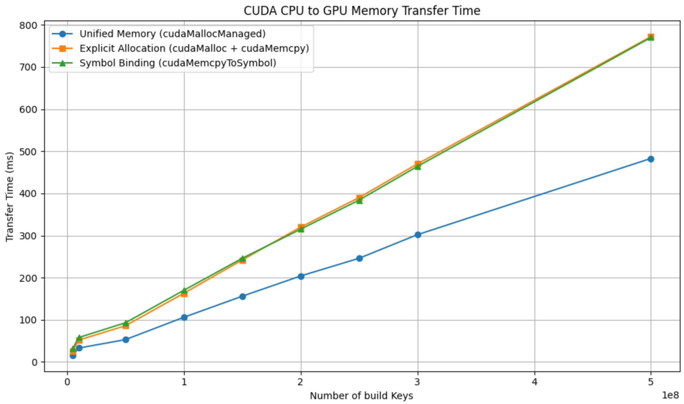

# ABBIG Memory Transfer Experiments

This repository benchmarks and compares three different memory transfer strategies in CUDA for loading the **ABBIG** (Array-Based B+ Tree Index on GPU) index structure from CPU to GPU memory.

The goal is to analyze the impact of each memory model on data transfer time when dealing with large-scale index structures (e.g., 250 million keys), as used in GPU-accelerated database systems.

## 📦 Experiment Files

The project includes three separate CUDA programs for the different memory models:

| File                          | Memory Model                     | API Used                          |
|-------------------------------|----------------------------------|-----------------------------------|
| `abbig_explicit_allocation.cu` | Explicit Allocation               | `cudaMalloc` + `cudaMemcpy`       |
| `abbig_global_mem_transfer.cu` | Symbol Binding (Global Memory)   | `cudaMemcpyToSymbol`              |
| `abbig_unified_mem_transfer.cu`| Unified Memory                    | `cudaMallocManaged`               |

Each file implements identical index construction and probing logic, differing only in how the ABBIG index is transferred to the GPU.

## 📊 Summary of Results

We evaluated the total index transfer time for all three strategies, particularly at large input sizes (up to **250 million keys**). The following are the key findings:

 

- **Unified Memory (`cudaMallocManaged`)** demonstrated the **fastest and most consistent transfer times**.
- **Explicit Allocation** (with `cudaMemcpy`) and **Symbol Binding** both incurred higher overhead, likely due to manual memory management and extra copy operations.
- For predictable memory access patterns like ABBIG's level-order layout, **Unified Memory allows the CUDA driver to optimize data placement and access**, improving cache and bandwidth utilization.

### ⏱️ Transfer Times at 250M Keys

| Memory Model       | Transfer Time (ms) |
|--------------------|--------------------|
| Unified Memory     | **246 ms**         |
| Explicit Allocation| 390 ms             |
| Global Symbol Copy | 384 ms             |

> 📌 **Conclusion**: Unified Memory is ideal for ABBIG’s large, structured data transfers, providing both performance and ease of programming.

## 🧪 How to Run

### 1. Clone Repository
```bash
git clone https://github.com/your-username/abbig-mem-experiments.git
cd abbig-mem-experiments
```

### 2. Build CUDA Files
```
nvcc -O3 abbig_explicit_allocation.cu -o run_explicit
nvcc -O3 abbig_global_mem_transfer.cu -o run_global
nvcc -O3 abbig_unified_mem_transfer.cu -o run_unified
```

### 3. Run Experiments
```
./run_explicit       # Explicit device allocation and copy
./run_global         # cudaMemcpyToSymbol to global memory
./run_unified        # Unified memory (cudaMallocManaged)
```

## 📁 Project Structure
```
abbig-mem-experiments/
│
├── abbig_explicit_allocation.cu     # Uses cudaMalloc and cudaMemcpy
├── abbig_global_mem_transfer.cu     # Uses cudaMemcpyToSymbol
├── abbig_unified_mem_transfer.cu    # Uses cudaMallocManaged
├── README.md
```

## 🧠 About ABBIG
ABBIG is a GPU-friendly indexing structure based on level-order traversal of B+ Trees. It uses array-based representations (keys and child index arrays) that eliminate pointer dereferencing and support coalesced memory access — ideal for GPU workloads.

Unified Memory further amplifies these benefits by handling page migration and access patterns automatically under the hood.